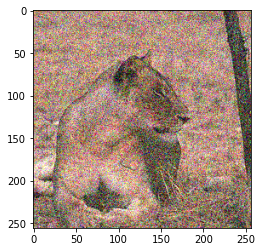
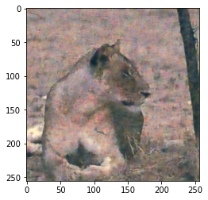
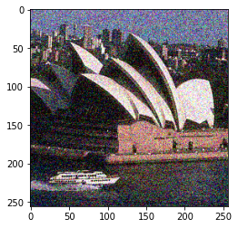
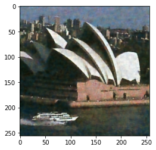
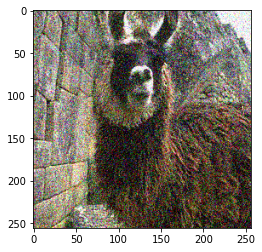
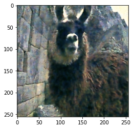

<h2>Ne2Ne Image Denoiser</h2>

A Gaussian Noise denoiser for images, based on the Neighbour2Neighbour algorithm from the paper [Neighbor2Neighbor: Self-Supervised Denoising from Single Noisy Images](https://arxiv.org/pdf/2101.02824.pdf). It leverages subamples of a noisy image as independent noisy pairs to perform training. 

### Results
The results are really good for an unsupervised pipeline, i.e, the training was performed using only noisy images and no clean images were used. Noisy-denoised image pairs follow.
<div align='center'>    
  <div>


  </div>
  <div>


  </div>
  <div>


  </div>
</div>


### Installing requirements

```
pip3 install -r requirements.txt
```

### Training


To train the model, run the following command after augmenting the parameters as per the need.

```
python3 train.py --epochs=15 --var=0.4 --batch=4 --learning_rate=0.001 --data_dir=./data --checkpoint_dir=./checkpoints
```

### Testing
To expermiment with saved model checkpoints, run the following command after updating the arguments. Download the checkpoint from this link: [Google Drive](https://drive.google.com/file/d/189Wq-XX0sVIoOGbl0aVBcKE9SLzcmLH2/view?usp=sharing)

```
python3 test.py --var=0.5 --data_dir=./data/test --checkpoint=./checkpoints/chckpt_gamma0_var_35.pt
```

### Dataset
I used 350 images from the [Berkeley Segmentation Dataset(BSD500)](https://www2.eecs.berkeley.edu/Research/Projects/CS/vision/grouping/resources.html#bsds500) for training. 100 images from the dataset were used for cross-validation, and 50 for test.

### Contact
[LinkedIn](https://www.linkedin.com/in/nrajpurohit/)
[Twitter](https://twitter.com/neerajr_)
